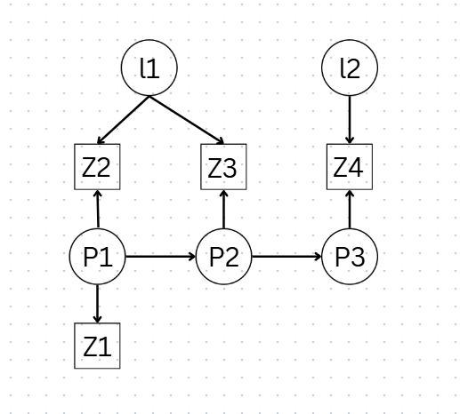
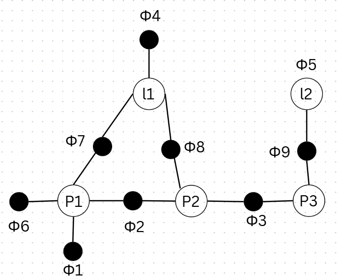

## The unknowns

We're solving for a state vector containing both robot poses and 
landmarks:

$$
\mathbf{x} = \begin{bmatrix} P_1 \\ P_2 \\ P_3 \\ l_1 \\ l_2 \end{bmatrix}
$$

where $P_i$ are robot poses at different times and $l_i$ are landmark
positions.

## Known vs. unknown

The measurements are what's "known" — but here's the key idea that trips 
people up at first: **every measurement carries uncertainty.** A LiDAR 
scan doesn't tell you "the wall is exactly 3.000m away." It tells you 
"the wall is probably around 3m away, plus or minus some noise."

That uncertainty is *why* SLAM is fundamentally a probability problem, 
not a geometry problem.

> **The robot never knows — it only believes.**

This isn't just a nice turn of phrase — it's the mathematical foundation 
of the whole field. The robot maintains a *belief*: a probability 
distribution over where it might be, not a single certain answer.

## Why probabilities must sum to one

$$
\int p(x)\,dx = 1
$$

This says: all possibilities sum to 1. In plain terms — the robot **must** 
exist somewhere. Its belief might be spread out and uncertain, but that 
uncertainty is distributed over the full space of possibilities, and it 
always adds up to total certainty that *some* pose is the true one.

This single constraint is what turns "the robot is confused about its 
position" into something we can actually compute with.

## The State Vector

Everything SLAM is trying to solve for lives in one big state vector, 
stacking robot poses and landmark positions together:

$$
\mathbf{x} = \begin{bmatrix} P_1 \\ P_2 \\ P_3 \\ l_1 \\ l_2 \end{bmatrix}
\rightarrow
\begin{bmatrix} x_1 \\ y_1 \\ \theta_1 \\ x_2 \\ y_2 \end{bmatrix}
$$

Each **pose** is $[x, y, \theta]$, and each **landmark** is $[x, y]$. 
Note that this is a *vector*, not a matrix — a flat list of all the 
unknowns concatenated together.

This matters because it tells you how the optimization actually works: 
it doesn't solve for the robot's path first and then the map, or vice 
versa. It solves for **every unknown at once**, jointly.

## The Posterior Distribution

The quantity we actually care about is:

$$
p(x \mid z) \Rightarrow P(\text{pose} \mid \text{measurements})
$$

In words: given everything the sensors have measured, what's the 
probability distribution over where the robot actually is (and where the 
landmarks actually are)?

## Why Factor Graphs?

The core idea is deceptively simple: **draw constraints as nodes.** 
Instead of writing one huge joint probability expression, we represent 
each piece of evidence — each measurement, each motion step — as its own 
node in a graph. This turns an intractable-looking equation into 
something structured and sparse.

## Bayesian Networks

Bayesian networks represent **joint probability** — but the trick is 
they don't store it as one giant function. Instead, they exploit 
**conditional independence** to break it into small, manageable pieces.

For example, take three variables $a$, $b$, $c$. If the dependency chain 
is $A \to B \to C$, then instead of needing the full joint distribution, 
we can factor it as:

$$
P(a,b,c) = P(a) \cdot P(b \mid a) \cdot P(c \mid b)
$$

This is the whole reason factor graphs are tractable at all — most 
variables in SLAM don't directly depend on most other variables, so we 
never need to compute anything close to the full joint distribution.

### Applying this to our state vector

The same logic applies directly to $p(x \mid z)$. By Bayes' rule:

$$
p(x \mid z) \propto p(z \mid x) \cdot p(x)
$$

Expanding over all our poses, landmarks, and measurements:

$$
\begin{aligned}
p(x \mid z) \;\propto\;\; & p(z_1,z_2,z_3,z_4 \mid P_1,P_2,P_3,l_1,l_2) \\
& \cdot\, p(P_1,P_2,P_3,l_1,l_2)
\end{aligned}
$$

Given the dependency structure — where $P_1 \to P_2 \to P_3$ form the 
trajectory, and $l_1, l_2$ are landmarks observed at different points 
along it — this factors into:

$$
\begin{aligned}
p(x \mid z) \;\propto\;\; & p(P_1) \cdot p(l_1) \cdot p(l_2) \\
& \cdot\, p(P_2\mid P_1) \cdot p(P_3\mid P_2) \\
& \cdot\, p(z_1\mid P_1) \cdot p(z_2\mid P_1,l_1) \\
& \cdot\, p(z_3\mid P_2,l_1) \cdot p(z_4\mid P_3,l_2)
\end{aligned}
$$

Every term in that product corresponds to one measurement or one motion 
step. Nothing here is arbitrary — it falls directly out of which 
variables were involved in producing which observation.

### From Bayesian network to factor graph

Here's the structure before and after the transformation:

**Bayesian network** (directed, showing dependency direction):

{width=500px}

**Factor graph** (undirected, showing which variables a constraint
touches):

{width=500px}

- Unary factors (priors): $\phi_1(P_1)$, $\phi_4(l_1)$, $\phi_5(l_2)$
- Motion factors: $\phi_2(P_2,P_1)$, $\phi_3(P_3,P_2)$
- Observation factors: $\phi_6(P_1)$, $\phi_7(P_1,l_1)$, $\phi_8(P_2,l_1)$, $\phi_9(P_3,l_2)$

The shift from Bayesian network to factor graph is really a shift in 
*what the nodes mean*. In the Bayesian network, arrows encode causal or 
conditional direction. In the factor graph, we drop the directionality 
and instead ask: which variables does this one constraint touch?

## What a Factor Graph Actually Is

> A factor graph is a graph that represents the **factorization of a function**.

A **factor** is just a function that says how compatible a set of 
variables is with one measurement. Every factor corresponds to one 
constraint — one measurement, one prior, one motion estimate.

The graph has exactly two kinds of nodes:

- **Variable nodes** (circles) — poses and landmarks, the things we're solving for
- **Factor nodes** (squares) — constraints, the evidence tying variables together

Because edges only ever connect a variable node to a factor node (never
variable-to-variable or factor-to-factor), this makes it a **bipartite
graph**. That bipartite structure is what keeps the whole system sparse
and efficient to optimize — most variables only touch a handful of
factors, not all of them.

## Types of Factors

Two flavors of constraint show up constantly in a factor graph:

- $\phi(P_1)$ — a **unary constraint**, or *prior*. It involves just one
  variable, expressing a belief about it in isolation (e.g., "the robot
  starts near the origin").
- $\phi(P_2, P_1)$ — a **binary constraint**, or *between* factor. It
  ties two variables together (e.g., "the robot moved this much between
  these two poses").

## Why Sparsity Matters

Here's the property that makes factor graphs practical at scale: they're
**sparse**. Most nodes never connect to each other. A landmark observed
early in a trajectory has no direct relationship to a pose visited much
later — they only become linked indirectly, through the chain of poses
in between. This makes sparsity one of the most important properties of
the whole system.

Formally, a factor graph is a tuple:

$$
F = (U, V, E)
$$

where $U$ = factor nodes, $V$ = variable nodes, and $E$ = edges. The
whole factorized function is just the product over all factors:

$$
\phi(x) = \prod_i \phi_i(x_i)
$$

This sparsity is why SLAM problems with thousands of poses and
landmarks are still solvable in real time — the underlying linear
systems end up being sparse matrices, and sparse solvers scale far
better than dense ones.
